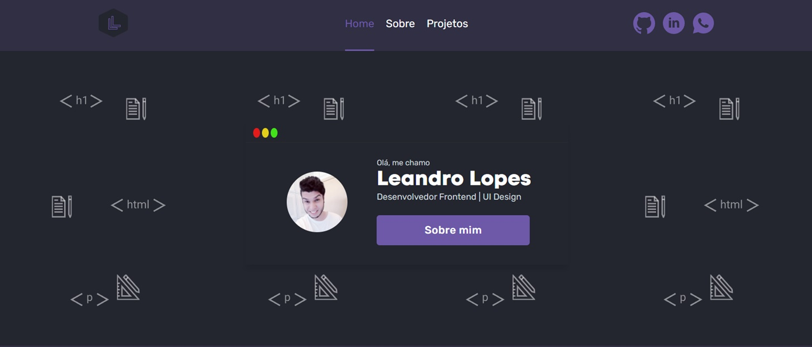

  

## Sobre
<h4 align="left">
  O objetivo do projeto era criar um site, onde eu poderia mostrar um pouco sobre mim e do meu trabalho.

  Um lugar onde eu poderia mostrar todo meu processo de criação e desenvolvimento de um projeto, mostrando as etapas de criação do design até a codificação.

  <a href="https://my-portfolio-d3vlopes.vercel.app/project/my-portfolio">Clique aqui</a> para conhecer como foi todo o processo de criação e desenvolvimento desse projeto.
</h4>

## Demo
https://my-portfolio-d3vlopes.vercel.app

## Principais features

- Páginas SSG & SSR com [NextJS](https://nextjs.org/)
- Criação de componentes com [Storybook](https://storybook.js.org/)
- Testes com [React Testing Library](https://testing-library.com/docs/react-testing-library/intro) & [Jest](https://jestjs.io/)
- Consumo de dados com [GraphQL](https://graphql.org/)
- Envio de email com [EmailJS](https://www.emailjs.com)

## Outras tecnologias e ferramentas utilizadas
- [TypeScript](https://www.typescriptlang.org/)
- [Styled Components](https://styled-components.com/)
- [Eslint](https://eslint.org/)
- [Prettier](https://prettier.io/)
- [Husky](https://github.com/typicode/husky)
- [Commitlint](https://commitlint.js.org/)
- [Graphql Codegen](https://www.graphql-code-generator.com/)
- [Graphql Request](https://github.com/prisma-labs/graphql-request)
- [GraphCMS](https://graphcms.com/)

## Layout
Você pode visualizar o layout do projeto <a href="https://www.figma.com/file/msZGD49dCxyy2iDAoN7Hav/My-Portfolio-(Public)?node-id=1201%3A989" target="_blank">clicando aqui</a>.
